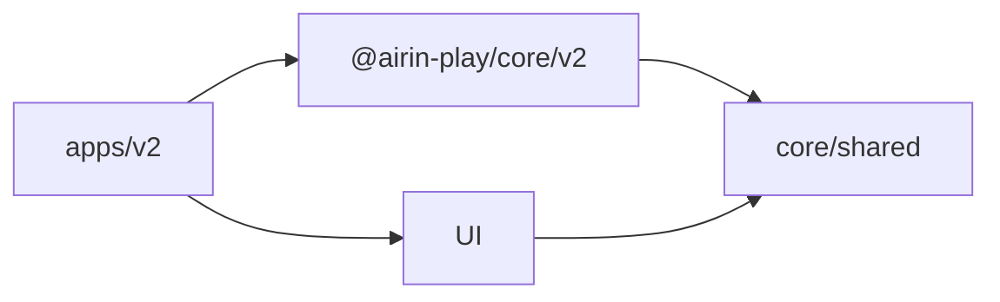
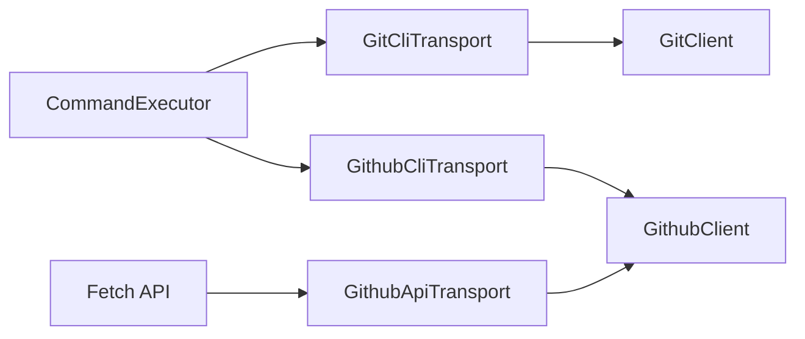

# Архитектура

## Цели

Архитектура обеспечивает четыре свойства:

1. приложение, расчётное ядро и общий UI разделены по workspace-пакетам;
2. в production-сборку попадает только актуальный движок;
3. правила игры тестируются отдельно от Vue-интерфейса;
4. результатом остаётся один автономный HTML-файл приложения.

## Граф зависимостей

Приложение использует расчётные типы и движок только через публичные `exports` пакета `@airin-play/core`. Скрипт `scripts/assemble-dist.ts` проверяет версию, автономность HTML и защитные метаданные production-сборки.

## Пакеты

### `@airin-play/core/shared`

Содержит типы и абстрактный `BaseEngine` с подтверждёнными общими правилами. Это публичная точка входа для типизации UI; приложения не должны обращаться к внутренним файлам мимо `exports` пакета.

### `@airin-play/core/v2`

Публичный расчётный API актуального приложения. Экспортирует класс `Engine` и его готовый экземпляр, включая построение идеальной цепочки. Собственный SemVer хранится в `core/v2/package.json`.

### `apps/v2`

Vue 3/Vite-приложение со своим `package.json`, `App.vue`, HTML-точкой входа и конфигурацией сборки.

### `packages/ui`

Общие визуальные компоненты и стили. Здесь не должно появляться знание о конкретной версии движка; приложение передаёт движок через типизированный интерфейс `SolverEngine`.

## Поток данных

Интерфейс хранит только фактическую историю ходов. Текущие цветовые очки, восторг, рекомендации и маршрут каждый раз вычисляются движком из этой истории. Благодаря этому отмена последнего хода не требует обратных мутаций счётчиков и остаётся детерминированной.

## Сборка

Vite собирает приложение отдельно, а `vite-plugin-singlefile` встраивает Vue runtime, JavaScript и CSS в один HTML. Затем `scripts/assemble-dist.ts` формирует `dist/v2/index.html`, корневой redirect и `.nojekyll`.

## Автоматизация Git и Github

Release- и RC-скрипты работают с внешними инструментами через объектные фасады:

`GitClient` инкапсулирует ветки, diff, squash-коммиты, теги и их публикацию. `GithubClient` предоставляет операции над
Pull Requests и Branch Protection, не раскрывая REST paths или команды CLI вызывающим скриптам.

Локально `GithubClientFactory` выбирает `GithubCliTransport` и использует системную сессию `gh auth`. В Github Actions
та же фабрика выбирает `GithubApiTransport` с временным `GITHUB_TOKEN`. `GitClientFactory` публикует теги через Git;
токен передаётся дочернему процессу временным HTTP-заголовком и не сохраняется в remote URL или checkout credentials.
Transport-зависимости внедряются через интерфейсы, поэтому клиенты тестируются без запуска Git, Github CLI и сети.
