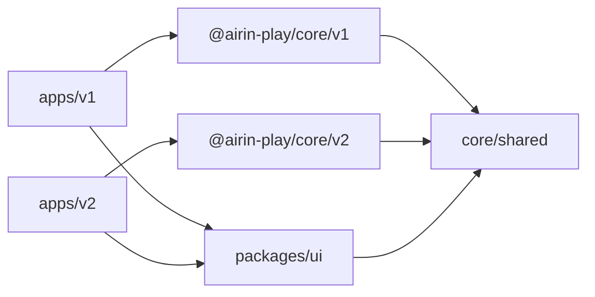

# Архитектура

## Цели

Архитектура обеспечивает четыре свойства:

1. v1 и v2 можно разрабатывать, тестировать и собирать независимо;
2. в production-сборку попадает только движок выбранного поколения;
3. правила игры тестируются отдельно от Vue-интерфейса;
4. результатом остаётся один автономный HTML-файл на версию.

## Граф зависимостей

Связей `apps/v1 → core/v2` и `apps/v2 → core/v1` нет. Скрипт `scripts/assemble-dist.mjs` дополнительно проверяет версию и уникальный маркер поколения в каждом итоговом HTML. Проверка не зависит от того, различаются ли номера версий v1 и v2.

## Пакеты

### `@airin-play/core/shared`

Содержит типы и абстрактный `BaseEngine` с подтверждёнными общими правилами. Это публичная точка входа для типизации UI; приложения не должны обращаться к внутренним файлам мимо `exports` пакета.

### `@airin-play/core/v1`

Публичный расчётный API первого поколения. Экспортирует класс `Engine` и его готовый экземпляр. Собственный SemVer хранится в `core/v1/package.json`.

### `@airin-play/core/v2`

Экспортирует класс с тем же именем `Engine`, но добавляет построение идеальной цепочки. Поколение определяется путём импорта, поэтому имя класса не содержит версии.

### `apps/v1` и `apps/v2`

Самостоятельные Vue 3/Vite-проекты со своими `package.json`, `App.vue`, HTML-точкой входа и конфигурацией сборки.

### `packages/ui`

Общие визуальные компоненты и стили. Здесь не должно появляться знание о конкретной версии движка; приложение передаёт движок через типизированный интерфейс `SolverEngine`.

## Поток данных

Интерфейс хранит только фактическую историю ходов. Текущие цветовые очки, восторг, рекомендации и маршрут каждый раз вычисляются движком из этой истории. Благодаря этому отмена последнего хода не требует обратных мутаций счётчиков и остаётся детерминированной.

## Сборка

Каждое приложение Vite собирает отдельно. `vite-plugin-singlefile` встраивает Vue runtime, JavaScript и CSS в один HTML. Затем `scripts/assemble-dist.mjs` формирует структуру `dist/v1` и `dist/v2`.
