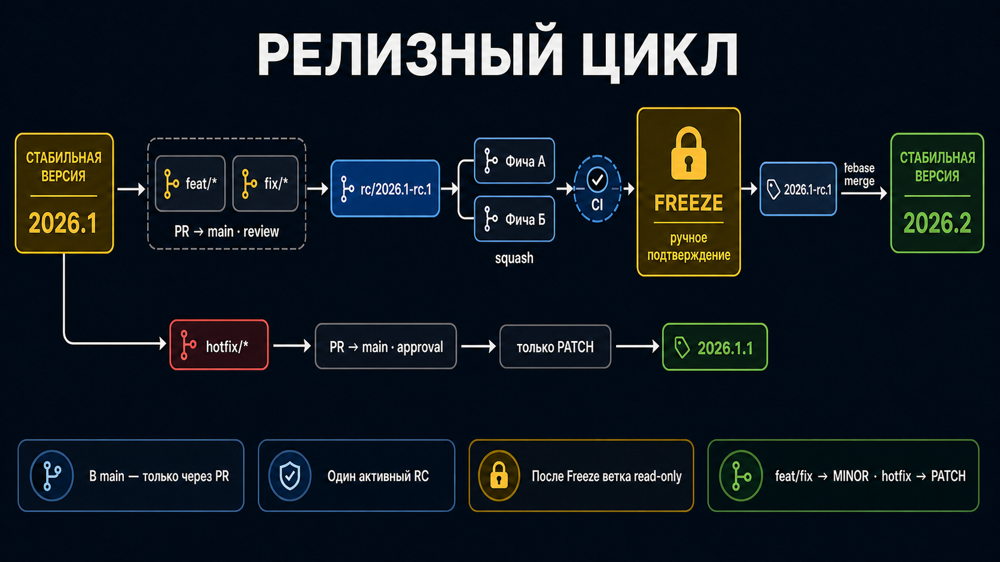

# Релизы репозитория

Репозиторий выпускается целиком по календарной схеме JetBrains `YYYY.R[.B]`: `2026.1` — функциональный релиз,
`2026.1.1` — его первый hotfix, `2026.2` — следующий функциональный релиз. SemVer компонента v2 не зависит от
календарного номера репозитория.

В пределах года функциональный номер увеличивается последовательно. При смене календарного года он начинается с
единицы. Hotfix сохраняет год и функциональный номер исправляемой линии и увеличивает только patch.

## Функциональный релиз

Обычный путь не требует ручной RC-ветки:

1. `feat/*`, `fix/*` или Dependabot PR проходит обязательные checks и принимается squash merge в `main`.
2. Workflow рассматривает все commits после последнего стабильного тега и определяет следующий функциональный номер.
3. GitHub Actions переносит `Unreleased` в датированный раздел, синхронизирует версию репозитория и создаёт отдельный
   bot-коммит.
4. На bot-коммит устанавливается неизменяемый стабильный тег.
5. Из этого тега собираются production archive, GitHub Release и GitHub Pages.

Если release run временно упал до создания тега, следующее обновление `main` снова рассматривает весь невыпущенный
диапазон. Изменение не считается выпущенным, пока стабильный тег не создан.

## Hotfix

`hotfix/*` PR также направляется прямо в `main`, но автоматический pipeline выбирает исключительно следующий patch.
В рабочей ветке достаточно исправления, теста и относящейся к нему записи `CHANGELOG.md / Unreleased`; вручную запускать
`release:prepare` не нужно.

## Опциональный RC

Для заранее согласованного набора можно оставить рабочие PR открытыми, собрать их командами `pnpm rc:create` и
`pnpm rc:add <PR>`, затем выполнить `pnpm release:prepare <next-release>`. RC проходит ручной Code Freeze, получает
неизменяемый RC-тег и вливается через rebase merge. Автоматический pipeline распознаёт подготовленную версию и сразу
создаёт стабильный релиз без дополнительного bot-коммита.

## CHANGELOG и Change Log

Это два разных представления:

- `CHANGELOG.md` содержит краткую пользовательскую историю стабильных версий;
- `RELEASE_NOTES.md` генерируется pipeline для текущего диапазона между стабильными тегами.

Для каждого релизного коммита генератор использует явный `#PR` или проверенную GitHub association и добавляет ссылки
на commit, PR и contributor. Технический release-коммит содержит `Release-Notes: skip` и не попадает в пользовательский
Change Log.

## Pipeline и Rulesets

`main` принимает пользовательские изменения только через PR с обязательными `Lint`, `Typecheck`, `Unit tests`,
`Release notes`, `Build` и `E2E tests`. История линейная, force push и удаление запрещены. Отдельный write deploy key
является единственным bypass-актором и подключается только в job автоматически сгенерированного release-коммита.

Merge чистого `docs/*` или `ci/*` PR не выпускает приложение, если после последнего стабильного тега нет ожидающих
продуктовых изменений. Подробная маршрутизация веток описана в [`branches.md`](branches.md).
